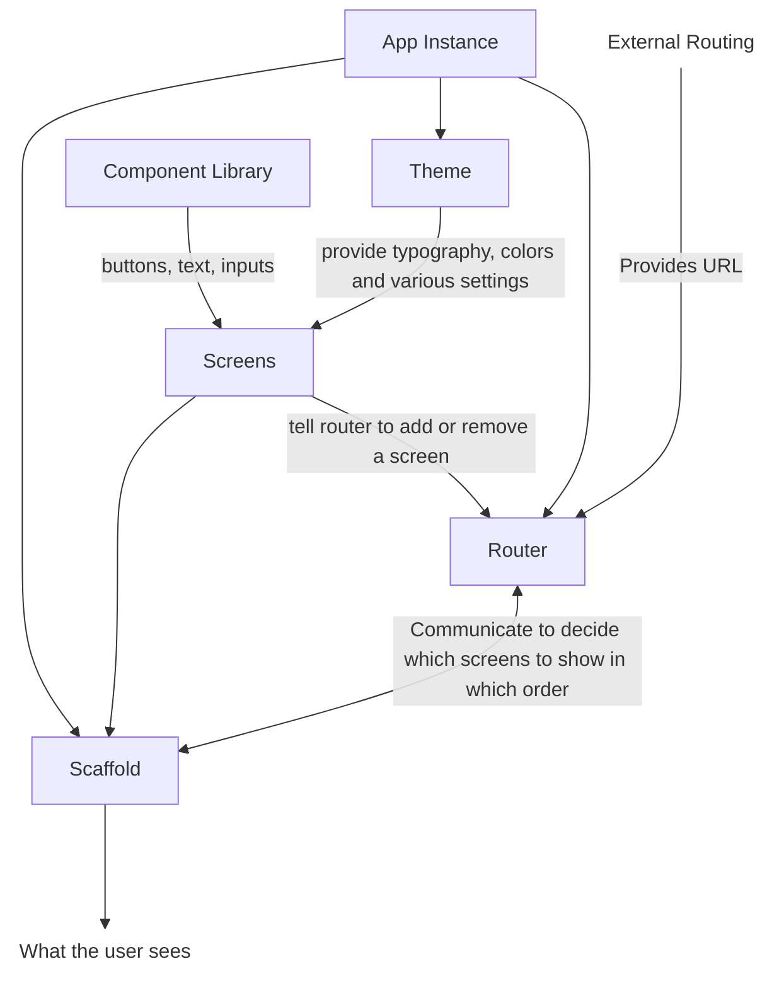

# oui

> Multi-platform UI library for Flutter.

```
1. The first letter of OneZero is O.
2. Zero is also known as O.
When you add ui to the end of O, you get oui.
```

Used in most of the apps produced by OneZero.

## Structure of `oui`



## CI Build Status


## Running Tests Locally

To run tests locally, use the following command:

```sh
flutter test
```

## Viewing Test Coverage Reports

To generate and view test coverage reports, use the following commands:

```sh
flutter test --coverage
genhtml coverage/lcov.info -o coverage/html
open coverage/html/index.html
```
